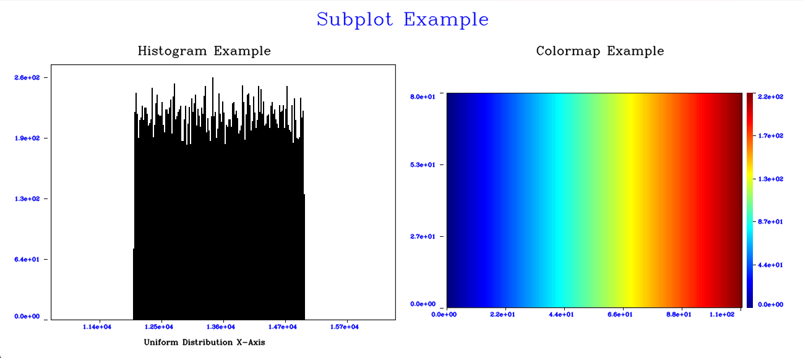

# OpenCVPlotTools

A C++ plotting library that generates basic plotting tools with the help of OpenCV library.


## Roadmap

This library is currently incomplete and exists on this platform for being a code sample.\
Here is the current state 0f the library:
- Histogram element ☑️
- Colormap element ☑️
- Subplots ☑️
- Plot element (work in progress)
- Table element (work in progress)

## Installation

Requirements of the library are as follows:\
-OpenCV\
-C++17 or later

While building the project, if the path of the OpenCV library hasn't been stored on the cmake cache, -DOpenCV_DIR=<PATH_TO_OPENCV_BUILD_DIRECTORY> should be added on the build command.
    
## Usage/Examples

The following example is based on the "Examples/Histogram_example.cpp" file.

```c++
    //Prepare the normal distributed histogram data and pass it on a Histogram object
    cv::Mat uniform(150, 200, CV_16U);
    cv::randu(uniform, 12000, 15000);
    Histogram hist{uniform, 200};

    //Set some of the available properties
    hist.setText(TextField::Title, "Histogram Example", 0.8F, PainterConstants::black);
    hist.setText(TextField::XAxis, "Uniform Distribution X-Axis", 1.0F, PainterConstants::black);
    hist.setPrecision(AxisType::XAxis, 2);

    //Prepare a gradient colormap
    cv::Mat gradient(80, 110, CV_8U);
    for (int c = 0; c < gradient.cols; c++) {
        gradient.col(c).setTo(c * 2);
    }
    Colormap cmap{ gradient, cv::COLORMAP_JET };
    cmap.setText(TextField::Title, "Colormap Example", 0.8F, PainterConstants::black);

    //Prepare the subplot element
    const std::vector<Plottable>plotElements{ hist, cmap };
    Subplot subplot{ plotElements, 1, 2 };
    subplot.setText(TextField::Title, "Subplot Example", 1.2F, PainterConstants::blue);

    cv::imshow("Subplot Example", subplot.generate());
    cv::waitKey(0);
}
```
The output canvas can be seen below:\



